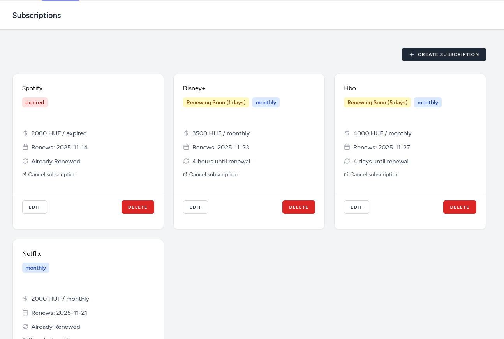
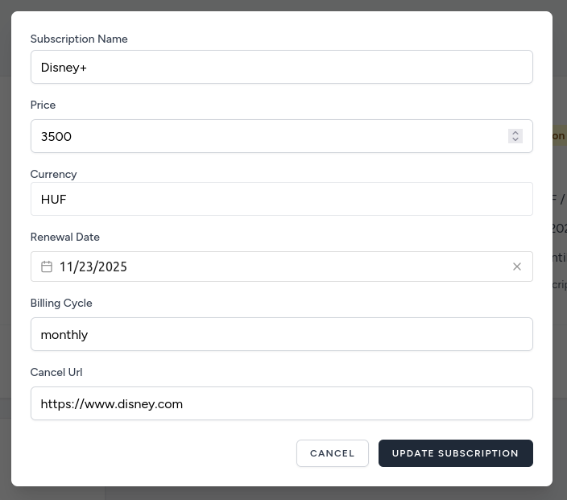
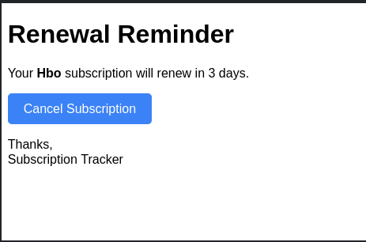

# Subscription Tracker

A web application to help manage and track your recurring subscriptions, with automated email reminders before renewal dates.

[Live Demo](TODO_DEPLOYMENT) | [Screenshots](#screenshots)

## Features

- **Subscription Management** - Create, view, edit, and delete subscriptions with details like cost, currency, renewal date, and cancellation URL
- **Dashboard Overview** - See all your subscriptions at a glance with total monthly costs
- **Email Reminders** - Automated email notifications 5 days before subscription renewals
- **Modal-based UI** - Clean, modern interface with create/edit modals for seamless user experience
- **Multi-currency Support** - Track subscriptions in HUF, EUR, or USD

## Tech Stack

**Backend:**
- Laravel 12
- PHP 8.2
- MySQL/SQLite
- Laravel Queues for scheduled emails

**Frontend:**
- Vue 3 (Composition API with TypeScript)
- Inertia.js
- Tailwind CSS
- Headless UI (for accessible components)
- Vue Datepicker
- Vue Toastification (notifications)

## Why I Built This

I frequently sign up for free trials and promotional subscriptions but often forget to cancel them before renewal. This app solves that problem by tracking all subscriptions in one place and sending reminders before charges occur.

## Getting Started

### Prerequisites

- PHP 8.2+
- Composer
- Node.js 20+
- MySQL or SQLite

### Installation

1. Clone and install dependencies:
```bash
   git clone https://github.com/andris0816/subscription-tracker.git
   cd subscription-tracker
   composer install
   npm install --legacy-peer-deps
```

2. Set up environment:
```bash
   cp .env.example .env
   php artisan key:generate
```

3. Configure your database in `.env`, then run migrations:
```bash
   php artisan migrate
```

4. Start the development servers:
```bash
   # Terminal 1 - Backend
   php artisan serve

   # Terminal 2 - Frontend
   npm run dev

   # Terminal 3 - Queue worker (for email reminders)
   php artisan queue:work
```

5. Set up the scheduler (for production):
```bash
   # Add to crontab
   * * * * * cd /path-to-project && php artisan schedule:run >> /dev/null 2>&1
```

## Usage

1. Register for an account and log in
2. Click "Create Subscription" to add a new subscription
3. Fill in details: name, cost, currency, renewal date, billing cycle, and cancellation URL
4. View all your subscriptions on the dashboard
5. Click "Edit" to update or "Delete" to remove subscriptions
6. Receive email reminders 5 days before each renewal

## Screenshots

[TODO Screenshots]
- Dashboard with subscription list

- Create/Edit modal

- Email reminder example


## What I Learned

- Building dynamic modal-based UIs with Vue 3 and Inertia.js
- Working with Laravel Queues and scheduled tasks for automated emails
- Implementing proper form validation and error handling

## Future Improvements

- Analytics dashboard showing spending trends over time
- Category tags for organizing subscriptions
- Budget alerts when total monthly costs exceed a threshold
- Integration with banking APIs for automatic subscription detection
- Export functionality (CSV/PDF reports)

## License

MIT

---

Built as a portfolio project by Bencsik András
